*Zastosowanie technologii deepfake do podmiany twarzy Idy Świątek na twarz Angeliny Jolie

Technologia deepfake za sprawą szybkiego postępu sztucznej inteligencji i związanych z nią technik generatywnych staje się narzędziem, do którego dostęp może mieć prawie każdy. Umożliwia ona modyfikowanie i tworzenie audiowizualnych treści z udziałem określonych osób, umieszczając je w kontekście zdarzeń, które mogły nigdy nie mieć miejsca. Termin “deepfake” swoją historią sięga roku 2017, kiedy to syntetyczne dane tworzone za pomocą generatywnych sieci przeciwstawnych prezentowały głównie treści pornograficzne. Warto jednak zauważyć, że fundamenty tej technologii, czyli architektura tej sieci powstała w roku 2014, a jedne z pierwszych metod modyfikowania obrazu i wideo wrzucane dzisiaj do worka z napisem “technologia deepfake” powstały dwa lata później. Jakość ówczesnych manipulacji audiowizualnych znacznie odbiegała od standardów, które obserwujemy obecnie, co tłumaczy, dlaczego termin „deepfake” nie był jeszcze wtedy tak szeroko rozpoznawalny jak jest dziś.

Obecnie dysponujemy na tyle rozwiniętymi technikami manipulacji treścią, że jesteśmy w stanie wytworzyć film prezentujący konkretną osobę w sytuacji, która nigdy się nie wydarzyła. Do tego celu wystarczy dostęp do średniej jakości komputera, kilkuminutowa próbka głosu lub nagrania dobrej jakości naszej ofiary i *voilà*! Cyberprzestępcy wykorzystują głos i wizerunek innych osób w celu wyłudzania pożyczek od bliskich osób ofiary, czy też tworzenia treści kompromitujących będących narzędziem szantażu. Często ofiarami stają się osoby publiczne, a wygenerowane treści korzystające z ich wizerunku mają na celu namawianie ludzi do ryzykownych inwestycji czy rejestracji na fałszywych giełdach kryptowalut. Deepfake'i prezentujące osoby publiczne mogą również mieć charakter dezinformacyjny, prowadząc do destabilizacji bezpieczeństwa społecznego lub dyskredytacji przedstawicieli państwa na scenie międzynarodowej.

Technologia deepfake to nie tylko podstawienie twarzy polityka i namawianie do ryzykownych inwestycji. Warto to podkreślić, zwłaszcza teraz, kiedy technika ta jest coraz częściej wykorzystywana w sposób nieetyczny. Jeżeli ktoś oglądał film “Irlandczyk” i zauważył, że twarz Roberta De Niro wyglądała nieproporcjonalnie młodo w porównaniu do reszty ciała - tłumaczę - za tym efektem stała właśnie technologia deepfake. Jeśli ktoś chce obejrzeć od nowa Matrixa, ale zamiast Keanu Reeves’a w roli głównej chciałby zobaczyć Rowana Atkinsona, aktora znanego bardziej z roli Jasia Fasoli, to proszę bardzo, technika ta umożliwia również taką zamianę. 

Metody modyfikacji i zamiany twarzy dają nowe narzędzia osobom odpowiedzialnym za dostarczanie nam rozrywki. Być może branża filmowa rozrośnie się o nową gałąź z dopiskiem “AI Powered”. Wówczas dostępność najpopularniejszych aktorów byłaby teoretycznie nieograniczona, gdyż wystarczyłoby zakupić model ich twarzy, nałożyć na twarz aktora, który byłby “dawcą” ciała, a zaoszczędzone pieniądze można byłoby zainwestować na ulepszanie efektów specjalnych. Jest to perspektywa dość kontrowersyjna, bo prawdziwy kunszt aktorski i ujrzenie idola na ekranie jest czymś nieporównywalnym do wygenerowanej tożsamości, lecz warto zwrócić uwagę na to, że pojawiają się nowe możliwości dla niskobudżetowych filmów, które być może mają ciekawą historię do przekazania. Wyobrażenie sobie obrazów z wizerunkiem ukochanej osoby, która raz po raz uśmiecha się do nas, może brzmieć jak historia wyciągnięta z filmu o Harrym Potterze, ale jesteśmy świadkami zjawiska, w którym technika AI zastępuje magię z filmów fantasy.

### Przekaz ponad barierami 

Współcześnie możemy wskazać na wiele pozytywnych przejawów wykorzystania tej technologii, takich jak pokonywanie kolejnych barier komunikacyjnych. Doskonałym przykładem tego typu innowacyjnego wykorzystania było wytworzenie filmu promującego inicjatywę "*Malaria must die*" z udziałem David'a Beckham'a. Materiał wyróżniał się, ponieważ przekaz słynnego piłkarza został wypowiedziany naprzemiennie w 9. różnych językach. Taki sposób prezentacji umożliwił dotarcie z przekazem do znacznie szerszego grona odbiorców na całym świecie. W realizacji tego projektu kluczową rolę odegrała właśnie technologia deepfake, która pozwoliła na modyfikację głosu oraz synchronizację ruchów warg Beckhama, aby wydawało się, że płynnie posługuje się wieloma językami.

*Kadr z filmu "Malaria Must Die" z udziałem Davida Beckhama*

Innym obszarem, w którym generowanie syntetycznych danych audiowizualnych może być niezwykle przydatna jest edukacja. Prezentacja realistycznych filmów, reprezentujących postacie historyczne, zgodne z ich opisami i obrazami, a nawet tonem ich głosów ma potencjał reprezentowania przeszłości w nowym wymiarze, zachowując także specyfikę ubioru czy scenerii, wymagającej dzisiaj pracy wielu specjalistów. Taki sposób może prezentować minione dzieje bardziej wielowątkowo i trafiać do wyobraźni oglądających w bardziej przystępny sposób.

### Deepfake postmortem

Pozostając jeszcze w Hollywood, nie sposób pominąć już dokonanych przykładów zastosowania. Przykładem jest głośna premiera nowego filmu "_Gwiezdne Wojny: Skywallker. Odrodzenie_", która miała stanąć przed próbą zaprezentowania fabuły po śmierci Carry Fisher, odgrywającej istotną rolę Księżniczki Lei. Reżyser podjął decyzję o zastosowaniu manipulacji prezentowanego obrazu w taki sposób, aby pośmiertnie nadać aktorce możliwość zwieńczenia swojej roli trzy lata po jej "oddaniu się mocy".

Takie praktyki są stosowane znacznie częściej. Już w 2015 roku, w ramach kinowej premiery ostatni raz mogliśmy zobaczyć Braian O'conner'a w siódmej odsłonie "Szybkich i wściekłych".  Aktor Paul Walker, odgrywający tę rolę, odszedł tragicznie w trakcie zdjęć do filmu. Część scen, zostało nagranych po jego śmierci z nałożeniem jego twarzy i głosu. Popularnie, tego rodzaju materiały nazywane są *postmortem deepfakes*.

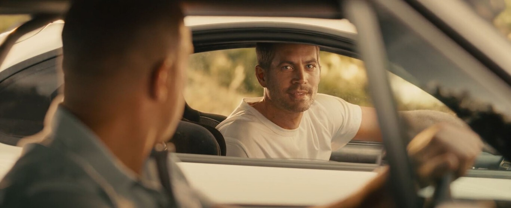
*Scena z filmu "Szybcy i wściekli 7" przedstawiająca pośmiertnie Paula Walkera (Braian O'conner)*

### Demokratyzacja technologii  

Manipulacja obrazem to zespół technik znany równie długo, jak powszechny dostęp do urządzeń służących do rejestrowania takich materiałów. Techniki te jednak znacząco ewoluowały dzięki nośnikom cyfrowym i szerokiemu spektrum narzędzi wspierających proces wprowadzania modyfikacji. Średniozaawansowana edycja obrazu nie wymaga dziś głębokiej, specjalistycznej wiedzy czy dostępu do podzespołów komputerowych przerastających możliwości przeciętnego użytkownika komputera. Zdecydowanie wyższą barierą wejścia sygnuje się manualna edycja filmów i dźwięku, która w branżach marketingowych czy rozrywkowych jest często z jednej strony kluczowa, a z drugiej czasochłonna. Mimo, iż jest to mniej rozbudowane, profesjonalna obróbka takich materiałów wymaga obszernej wiedzy i doświadczenia. Jednakże, szybki rozwój sieci generatywnych może niedługo zmienić ten stan rzeczy.
Wystarczy porównać jakość prezentowanych efektów specjalnych wykorzystujących technologię deepfake we współczesnych filmach akcji, a w ich kultowych, starszych odpowiednikach, kiedy technologia nie była na tyle rozwinięta. 
Można przewidywać, że koszty produkcji będą się zmniejszać w sposób odwrotnie proporcjonalny do jakości tych efektów, z potencjalną redukcją kosztów produkcji filmów animowanych o 90%. Co zostało wspomniane w rozdziale wcześniej, podobny los może czekać w przyszłości branżę filmową, w której akcje filmu wedle scenariusza wykonywane będą bez fizycznego udziału ludzi, a nawet i przy wykorzystaniu realnego wizerunku aktora. W świetle następnych kamieni milowych w generowaniu filmów, technologia staje się coraz bardziej zdolna do rzucenia tego typu wyzwania. Przytoczyć w tej kwestii można dwie premiery z lutego 2024. roku, mianowicie Sora, czyli model OpenAI generujący zaskakująco realistyczne materiały wizualne oraz nowa architektura V-Jepa od firmy Meta, zdolna w czasie rzeczywistym uczyć się filmów i "domyślać się" zasłoniętych treści, naśladując ludzki proces uczenia.
 
 *Prezentacja możliwości modelu V-Jepa, zdolnego do odtwarzania zasłoniętych elementów, Źródło: https://pl.techwar.gr/342233/v-jepa-i-apantisi-tou-meta-stin-syntheti-katanoisi-vinteo/ 
 

### Fałszywa pamięć

Naukowcy ze School of Applied Psychology w University College Cork przeprowadzili badania dotyczące zjawiska nazwanego “fałszywą pamięcią” (ang. *false memory*). W eksperymencie uczestniczyło 436 osób, którym pokazano fragmenty popularnych filmów. Część z tych materiałów była oryginalna, a na pozostałych twarze aktorów zostały podmienione technikami deepfake. Głównym celem badania było zbadanie, czy uczestnicy zaakceptują zmanipulowane fragmenty jako autentyczne wersje filmów. Według opublikowanych wyników średni wskaźnik fałszywej pamięci wyniósł 49%, co oznacza, że prawie połowa badanych uwierzyła, iż zmanipulowane sceny są oryginalnymi wersjami filmów. Co więcej, wielu z nich zapamiętało fałszywe wersje jako lepsze od oryginałów. 

Zjawisko fałszywej pamięci zostało zamieszczone w niniejszym wpisie nie bez powodu. To badanie podkreśla, jak łatwo ludzka pamięć może zostać zmanipulowana, zwłaszcza w obliczu technologii umożliwiających tworzenie przekonujących fałszywych treści. Można założyć, że współczynnik mógłby być wyższy, jeżeli manipulacje byłyby idealne, pozbawione niespójności budzących podejrzeń. W myśl powiedzenia “kłamstwo powtarzane sto razy staje się prawdą” i dodając do równania prędkość dystrybucji informacji w internecie niektóre manipulacje mogą nagle zlać się z prawdą, co może nieść za sobą daleko idące konsekwencje, zarówno na poziomie indywidualnym, jak i społecznym, podważając zaufanie do dostępnych informacji i wpływając na nasze postrzeganie rzeczywistości.

## Ciemna strona deepfake

Samo pojęcie deepfake, będące nawiązaniem do tworzenia nieprawdziwych treści (*"fake"*) za pomocą głębokich ("*deep*") sieci neuronowych, zostało zaobserwowane pierwszy raz w 2017 r. na platformie Reddit. Wtedy to jeden z moderatorów stworzył tzw. "subreddit", rozumiany jako temat dyskusji, w której to zaczęto publikować realne filmy pornograficzne, zawierające modyfikację twarzy występujących w filmach aktorów na podobizny celebrytów. W pewnym sensie, poprawnym jest stwierdzenie, iż etymologia słowa deepfake jest bezpośrednio związana z pornografią...
Niestety, zainteresowanie wykorzystania technik takich jak zamiana twarzy nie straciła na popularności w perspektywie nieprzyzwoitych treści, nadając mu nowy wymiar. Wedle raportu *"2023 State of Deepfakes"* sporządzonego przez *Home Security Heroes*, od 2019 do 2023 roku ilośc tego typu filmów dostępnych online wzrosła o 550%. Pornografia stanowi zawrotne 98% wszystkich zmodyfikowanych filmów dostępnych w sieci. Zgodnie z przedstawionym w raporcie wnioskom, treści te są niemal w całości wykorzystywane przeciwko kobietom, jako sposób szantażu czy zniesławienia w celu zniszczenia kariery zawodowej czy napaści seksualnej. Wskazano nawet, iż w jednym z hiszpańskich miast, 30 dziewcząt w wieku od 12 do 14 lat narażono na rozprzestrzenienie ich sfalsyfikowanych zdjęć pornograficznych. Co gorsza nie jest to odosobniony przypadek w skali globalnej. Takie działania mogą bardzo poważnie wpłynąć na stan psychiczny kobiet dotkniętych tego typu przestępstwami, a także wzmagają niepokój społeczny, ze względu na rosnącą prostotę przeprowadzania takich manipulacji.

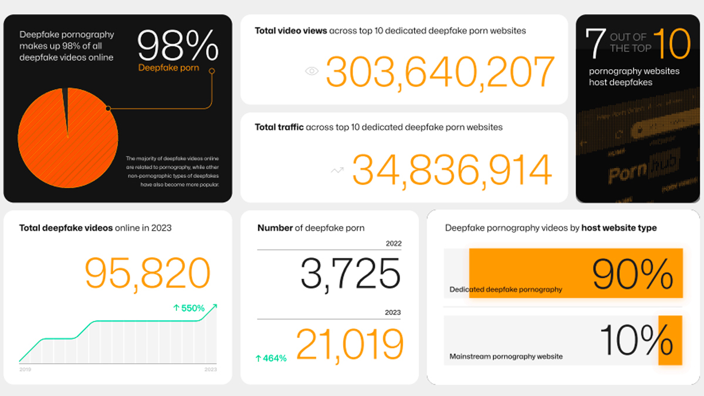
*Informacje statystyczne dotyczące rozpowszechnienia i oglądalności materiałów deepfake wskazane w raporcie "2023 State of Deepfakes".*

## Cyberprzestępstwa

Jak już opisano wcześniej, technologie umożliwiające tworzenie syntetycznych materiałów znajdują szerokie zastosowanie w takich dziedzinach jak filmografia, edukacja i sztuka cyfrowa, oferując wsparcie w procesie produkcji treści. Jednakże, ten sam zestaw narzędzi może być również wykorzystywany do manipulacji, oszustw, czy naruszania prywatności. 
Cyberprzestępczość nasila się na całym świecie, a technologie sztucznej inteligencji, wspierają oszustów w kradzieży tożsamości, wykorzystując ją do szerzenia dezinformacji m.in. poprzez tworzenie rzeczywistych wizerunków i głosów.

Przykładem skuteczności takich metod jest przekonanie pracownika międzynarodowej firmy z oddziałem w Hongkongu do przekazania 25 milionów dolarów oszustom. Pomimo wstępnych podejrzeń pracownika co do otrzymanych mailowo instrukcji, zorganizowana przez oszustów wideorozmowa, podczas której podszywali się oni pod członków organizacji, zniwelowała jego obawy i skłoniła do działania zgodnie z fałszywymi instrukcjami rzekomego dyrektora finansowego. Analogicznie, w brytyjskiej firmie energetycznej, oszuści nakłonili pracownika do przelania 220 000 euro, wykorzystując do tego celu perfekcyjnie imitowany głos i akcent rzekomego przełożonego.

https://edition.cnn.com/2024/02/04/asia/deepfake-cfo-scam-hong-kong-intl-hnk/index.html
https://www.forbes.com/sites/jessedamiani/2019/09/03/a-voice-deepfake-was-used-to-scam-a-ceo-out-of-243000/

Zdarzają się przypadki, w których oszuści wykorzystują zmanipulowane materiały, z udziałem publicznie rozpoznawalnych osób w celu promowania różnego rodzaju oszustw, zwanych potocznie "*scamami*". Takie materiały mogą prezentować celebrytów, wpływowych liderów biznesu lub inne znane postacie, które rzekomo popierają produkty inwestycyjne, inicjatywy związane kryptoaktywami lub inne schematy zarobkowe. W rzeczywistości, te osoby nigdy nie wyraziły zgody na wykorzystanie swojego wizerunku, a materiały są sfałszowane. To zjawisko jest powszechnie rozpoznawalne również w kontekście polskim. W październiku 2023r. na fałszywym kanale na Facebooku pojawił się materiał wykorzystujący wizerunek Roberta Lewandowskiego, promujący szybkie zarabianie pieniędzy za pomocą aplikacji mobilnej. Podkreślano, że wykorzystywana przez piłkarza aplikacja bez wysiłku generuje przychód 500 EUR miesięcznie. Innym tego typu procederem były rzekome programy inwestycyjne Baltic Pipe Project, uruchomionego przez polski rząd, który "*gwarantuje wszystkie wypłaty*". Reklamy te wykorzystywały wizerunki polskich polityków, m.in. Mateusza Morawieckiego, Andrzeja Dudy, Jarosława Kaczyńskiego. Nie były to akcje przedstawiane wyłącznie w formie postów na portalach społecznościowych, ale także reklamy wyświetlane w wielu innych przestrzeniach internetowych.
https://niebezpiecznik.pl/post/uwaga-na-deepfakei-z-vip-ami-np-andrzejem-duda-robertem-lewandowskim/

*Fałszywa reklama aplikacji do inwestycji, wykorzystująca wizerunek znanego piłkarza polskiego Roberta Lewandowskiego z wygenerowanym materiałem głosowym.*

Również powszechne stały się tzw. "*farmy trolli*", czyli zorganizowane grupy, tworzące fałszywe konta na mediach społecznościowych. Wykorzystują one technologię deepfake do nadawania większej wiarygodności swoim działaniom, poprzez tworzenie realistycznych zdjęć i nagrań, imitując autentyczne konta. Te konta są wykorzystywane do manipulowania opinią publiczną, rozsiewania dezinformacji oraz wpływania na dyskurs polityczny i społeczny.

https://cyberscoop.com/fbi-foreign-actors-deepfakes-cyber-influence-operations/

Za sprawą działalności cyberprzestępców na mediach społecznościowych możemy natknąć się na deepfake w reklamach, na których możemy ujrzeć polityków i osoby publiczne.

*Reklama wykorzystująca wizerunek polityka.*

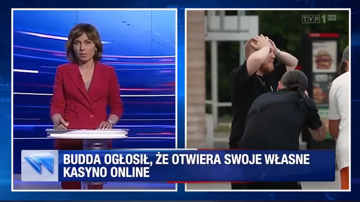
*Reklama fałszująca transmisję TVP, wykorzystująca metody syntezy głosu

Uważa się, że jednym z głównych zagrożeń w 2024 roku będą polityczne ataki deepfake, które wpisują się w szeroko pojęty obszar zagrożeń społecznych. Zjawisko to może mieć znaczenie na arenie międzynarodowej, zwłaszcza podczas wyborów prezydenckich w Stanach Zjednoczonych, jak również podczas lokalnych wyborów samorządowych w Polsce czy wyborów do Parlamentu Europejskiego. Rozwój technologiczny niesie za sobą takie wyzwania, na które konieczne jest znalezienie adekwatnych odpowiedzi. Jednym z fundamentalnych problemów wolnych społeczeństw jest identyfikacja fałszywych treści deepfake, co komplikuje się dodatkowo dążeniem do ochrony wolności słowa. Taka postawa, z natury szlachetna, spowalnia jednak reakcje, zgodnie z powiedzeniem, że "*kłamstwa podróżują po całym świecie, zanim prawda zdąży założyć buty*".

## Rodzaje wizualnych deepfake
### Zmiana tożsamości (identity swap)

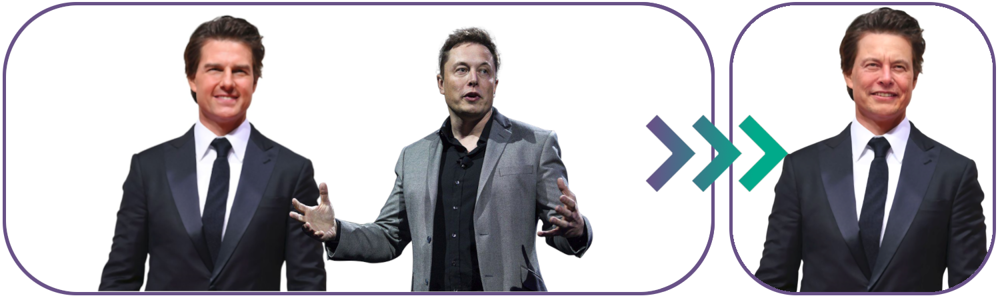

Technika podmiany tożsamości pozwala na przeprowadzenie transferu twarzy, bądź całej głowy jednej osoby na ciało innej. Jest to proces, który może dostarczyć bardzo wiarygodne rezultaty, szczególnie, gdy fryzura i rysy twarzy osoby, której tożsamość jest przenoszona (tzw. źródło) są podobne do tych, na której ma zostać przeprowadzona zamiana (tzw. cel). Wówczas trudność identyfikacji takiego materiału jako fałszywy staje się jeszcze większa.
### Odtwarzanie twarzy (face reenactment)

Technika odtwarzania twarzy umożliwia animację statycznego zdjęcia osoby, wykorzystując film referencyjny, który zawiera docelową mimikę i ruchy. Dzięki temu, na podstawie jednego zdjęcia i odpowiedniego nagrania wideo, można odtworzyć dynamiczne ekspresje twarzy, mruganie, uśmiech czy mówienie. Wykorzystując tę metodę, można uzyskać nagrania wypowiedzi, bądź ruchu twarzy osoby docelowej posiadając tylko jedno, dobrej jakości zdjęcie przedstawiające tę osobę.

### Przekształcanie dźwięku w ruch ust (wav to lip) 

W ostatnich latach ogromną popularność zdobyła innowacyjna metoda znana jako "*wav to lip*", która rewolucjonizuje sposób, w jaki postrzegamy i interpretujemy materiały wideo. Podstawą tej technologii jest prosty, ale niezwykle efektywny pomysł synchronizacji ruchów warg postaci na ekranie z dźwiękiem podanym jako wejście. W praktyce oznacza to, że widzowie otrzymują wrażenie, że osoba na ekranie faktycznie wypowiada słowa, które słychać w nagraniu audio. Efekt jest tak przekonujący, że powstają wrażenie autentycznych wypowiedzi, choć w rzeczywistości są one wytworem sztucznej manipulacji. Dzięki wykorzystaniu zaawansowanej syntezy dźwięku, nagrania te zdają się być niezwykle realistyczne, co stwarza nowe wyzwania w kontekście autentyczności prezentowanych treści w erze cyfrowej.
### Modyfikacja atrybutów twarzy (face attributes modification)

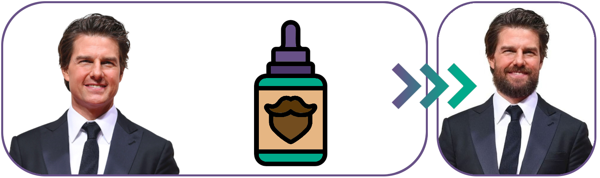

Modyfikacja atrybutów twarzy to proces zmiany wyglądu twarzy na materiałach wizualnych, umożliwiając m.in. modyfikację koloru oczu, stylu owłosienia, zmianę mimiki, korektę stanu uzębienia i kondycji cery. Jest to metoda szczególnie popularna w branży beauty, ponieważ umożliwia wizualizację potencjalnych efektów zabiegów estetycznych przed podjęciem działania. Ostatnimi czasy technika ta znajduje swoje zastosowania także w narzędziach do organizacji spotkań biznesowych online, sprawiając wrażenie utrzymywania ciągłego kontaktu wzrokowego.
### Łączenie twarzy (face morph)

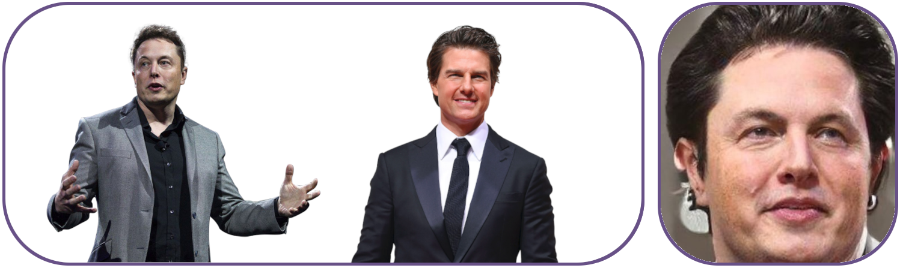

Metoda face morph polega na połączeniu wizerunków twarzy dwóch różnych osób. Efektem tego procesu jest stworzenie nowego zdjęcia, na którym widnieje fikcyjna postać, łącząca w sobie cechy wyglądu obu użytych do procesu osób. Choć metoda ta może mieć wiele pozytywnych zastosowań (szacowanie wyglądu dziecka), niestety jest również wykorzystywana przez przestępców do tworzenia fałszywych dokumentów tożsamości. Zdjęcie utworzone w ten sposób może jednocześnie zawierać elementy charakterystyczne dla potencjalnej ofiary oszustwa, jak i dla osoby, która nielegalnie wykorzystuje czyjś wizerunek. Dodatkowo, zdjęcia tworzone za pomocą tej techniki mogą łatwo zwieść systemy biometryczne, szczególnie te o niższej jakości, co stanowi poważne zagrożenie dla mechanizmów weryfikacji tożsamości.

### Syntetyczna twarz (fully synthetic face)

Twarze w pełni syntetyczne przedstawiają wizerunki osób, które nie istnieją, a ewentualne podobieństwa są całkowicie przypadkowe. Algorytmy, po analizie wielu różnorodnych wizerunków ludzkich, uczą się wyglądu ludzka twarz i są w stanie tworzyć nowe wizualizacje o losowo dobranych atrybutach wyglądu. 

Istnieje również możliwość tworzenia syntetycznych twarzy na podstawie zdjęcia referencyjnego. W takim przypadku wygenerowany obraz zachowuje pewne podobieństwo do osoby ze zdjęcia źródłowego, przy czym model sztucznej inteligencji dąży do odnalezienia i wykorzystania cech najbardziej zbliżonych do tych, które identyfikuje na wzorcowym wizerunku.

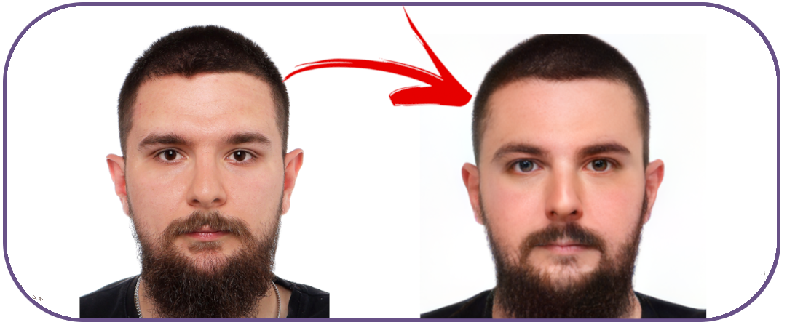

## "Jak to jest zrobione?" - o tworzeniu wizualnego deepfake

Tworzenie zmanipulowanego materiału wizualnego może odbywać się na wiele różnych sposobów, a ilość zasobów potrzebnych do wykonania deepfake daną techniką jest zwykle proporcjonalna do jakości wyników. Do podstawowych manipulacji mogą wystarczyć dwa zdjęcia: jedno przedstawiające cel, czyli ciało, do którego ma zostać dołączona twarz oraz  drugie będące źródłem, czyli zdjęciem twarzy, którą chcemy wstawić. 
Inne, bardziej efektowne i zaawansowane metody wymagają analizy dziesiątek tysięcy zdjęć danej osoby, na których uchwycono zróżnicowane ustawienie twarzy, mimikę i ekspresję twarzy oraz reakcje skóry na różne warunki środowiskowe, takie jak oświetlenie czy wpływ temperatury – na przykład pot, zmiany w odbiciu światła od skóry czy zaczerwienienie.

W procesie tworzenia deepfake'ów wykorzystywane są również metody wykrywania charakterystycznych punktów twarzy, które składają się na jej szczegółową mapę, pozwalając komputerowi na odpowiedni dobór rotacji i skali maski do twarzy, aby ta jak najlepiej mogła wkomponowywać się w dany obraz.
  

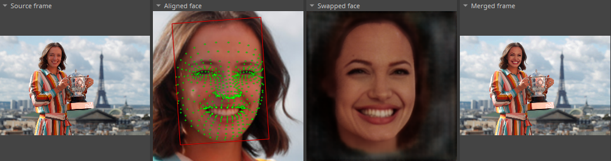
*Proces nakładania maski twarzy Angeliny Jolie na zdjęcie przedstawiające Igę Świątek.*

Deepfake’i najwyższej jakości, które z założenia mają być nieodróżnialne od rzeczywistych zdjęć zwykle poddawane są ręcznej obróbce przez specjalistów od grafiki komputerowej, tzw. post-processingowi. Ta dodatkowa modyfikacja polega na korygowaniu wszelkich niedoskonałości, wygładzaniu krawędzi maski oraz dostosowywaniu przejść gradientu, aby finalny materiał był jak najbardziej zbliżony do rzeczywistości i tym samym, trudniejszy do wykrycia jako fałszywy.

## Audio deepfake

Generowanie syntetycznych głosów, znanych również jako audio deepfake’i dzieli się na na dwa podejścia: konwersję tekstu na mowę (ang. *Text-To-Speech*, TTS), oraz klonowanie głosu (ang. *voice cloning*, VC).

Systemy syntezy głosu Text-to-Speech (TTS) oparte na sieciach neuronowych działają poprzez przekształcanie wprowadzanego tekstu w syntetyczną mowę. Proces zaczyna się od analizy i przekształcanie tekstu na fonetyczne elementy, które są następnie interpretowane przez algorytmy lingwistyczne. Algorytmy te odzwierciedlają intonację i akcenty potrzebne do uzyskania naturalnie brzmiącej mowy. Kolejnym etapem jest wyciągnięcie cech akustycznych człowieka. W procesie wytwarzania mowy człowieka biorą udział różne części anatomiczne, takie jak jama nosowa, podniebienie, język, wargi, żuchwa, a także strumień powietrza z płuc. Częstotliwości rezonansowe, które powstają, gdy powietrze przechodzi przez tor akustyczny tworzy dźwięk, zawierający unikalne właściwości głosu każdej osoby. Z zapisu dźwięku, wydobywa się unikalne cechy dla każdego człowieka tworząc embedding cech akustycznych. W ostatnim kroku cechy akustyczne danego człowieka są “łączone” z cechami fonetycznymi tekstu, pozwalając na generowanie realistycznie brzmiącego głosu. Elementem odpowiedzialnym za ten proces jest moduł kodowania głosu, zwany vocoderem (od połączenia słów voice + coder). Vocoder syntezuje fale dźwiękowe, będące zapisem cyfrowym sygnałów audio, które mogą być następnie odtwarzane jako mowa. Odpowiada za kształtowanie brzmienia mowy, nadając jej charakterystyczne cechy głosowe danego człowieka.

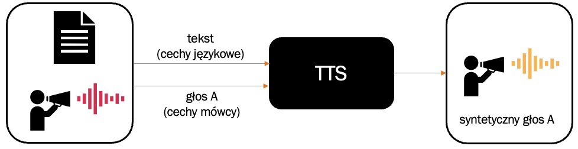*Uproszczony schemat działania systemu TTS. Moduł generuje mowę na podstawie dostarczonej treści i próbki głosowej danego człowieka.*

Klonowanie głosu, to bardziej zaawansowana technologia, która pozwala na tworzenie cyfrowych kopii głosów ludzi. Systemy VC to zaawansowane techniki przetwarzania sygnałów audio, które pozwalają na przeniesienie indywidualnych charakterystyk głosowych jednej osoby - mówcy źródłowego A do generowania syntetycznej mowy za pomocą innego mówcy - mówcy docelowego, który dostarcza treść i sposób mowy. Proces klonowania głosu rozpoczyna się od ekstrakcji indywidualnych cech głosowych z próbek audio źródłowego mówcy A. Te cechy, nazywane również *embeddingami*, czyli esencją tego, co sprawia, że każdy głos jest wyjątkowy. Następnie system VC wykorzystuje te *embeddingi* do wygenerowania mowy, która ma cechy charakterystyczne dla głosu źródłowego mówcy, ale zawiera treść wypowiedzi docelowego mówcy B. Systemy te umożliwiają nie tylko reprodukcję tonu, modulacji i akcentu danego człowieka, ale także pozwalają naśladować emocje i sposób mówienia. 

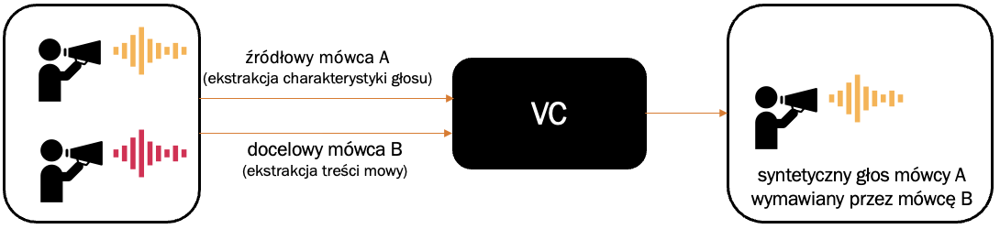
  *Uproszczony schemat działania systemu VC. Moduł ten generuje syntetyczny głos na podstawie cech akustycznych mówcy źródłowego oraz treści i sposobu mówienia docelowego mówcy (fałszerza)*

Nowoczesna technologia pozwala na tworzenie dobrej jakości syntetycznych materiałów audio bazując tylko na minucie głosu w przypadku metod TTS i około 6 minut dla podejścia klonowania głosu. Poniżej zamieszczone są przykłady syntetycznej mowy wygenerowane metodą TTS, wykorzystującą komercyjne oprogramowanie ElevenLabs oraz VC, uzyskane narzędziem RVC o otwartym kodzie źródłowym.

*Przykład treści wygenerowanej na podstawie tekstu i próbki głosu o długości około 60 sekund.*

*Przykład syntetycznej mowy uczonej na próbce głosu o długości 6 minut.*

## Jak rozpoznać deepfake?

### Czy człowiek potrafi wykryć deepfake?
  
Rozpoznanie deepfake przez człowieka jest zadaniem niezwykle trudnym, głównie z powodu coraz wyższej jakości i przekonującego charakteru tych materiałów. W listopadzie 2023 ukazał się artykuł, który przedstawia badanie oceny umiejętności ludzi w identyfikowaniu wysokiej jakości deepfake'ów w zestawie filmów. Autorzy pracy wykazali, że w środowisku naturalnym, bez wcześniejszych ostrzeżeń o potencjalnej obecności fałszywych treści, osoby narażone na neutralnie tematyczne fałszywe filmy nie wykazywały większej zdolności do wykrywania anomalii w porównaniu z grupą kontrolną, która miała dostęp jedynie do autentycznych filmów. Dodatkowo, po zastosowaniu ostrzeżenia, że wśród pięciu filmów może znajdować się przynajmniej jeden deepfake, jedynie 21,6% respondentów skutecznie zidentyfikowało deepfake jako jedyny nieautentyczny film, natomiast reszta błędnie uznała co najmniej jeden z autentycznych filmów za fałszywy.

Podobne badania zostały przeprowadzone na danych audio. Naukowcy z University College London sprawdzali, w jakim stopniu ludzie są w stanie odróżnić autentyczną mowę człowieka od sztucznie wygenerowanych komunikatów przy użyciu technik deepfake. Okazało się, że mowę wygenerowaną za pomocą AI uczestnicy badania poprawnie identyfikowali tylko w 73% przypadków. Osoby, które udzieliły poprawnej odpowiedzi, zauważały, że ich uwagę w nagraniach zwracał oddech, odstępy między słowami oraz płynność mówienia. Wynik ten poprawił się jedynie nieznacznie wśród uczestników badania, którym przedstawiono, jakie cechy mogą wskazywać na sztucznie wygenerowaną mowę, a następnie odtworzono im kilka nagrań, informując, że są to deepfake'i.

### Wykrywanie syntetycznych głosów

Audio deepfake’i obecnie nadal zawierają wiele niedoskonałości. W obliczu materiałów budzących podejrzenia lub w trakcie rozmów telefonicznych o charakterze socjotechnicznym, które grają na emocjach, warto zwrócić uwagę na nietypowe przerwy w mowie, które mogą wskazywać na sztuczne spajanie fragmentów wypowiedzi. Innym wskaźnikiem są nienaturalne intonacje, często rozbieżne z emocjami, które powinny towarzyszyć wypowiedzi.  

W trakcie nagrania lub wypowiedzi może dojść do nieoczekiwanej zmiany barwy głosu, tonu, wysokości dźwięku, lub akcentu. Metody syntezy głosu czasem mają problem z utrzymaniem konsekwentnie określonego profilu głosowego. Dodatkowym sygnałem mogą być błędy w wymowie słów, przede wszystkim liczb, dat, nazwisk, terminów technicznych i słów obcojęzycznych. Przykład takiej sytuacji obserwujemy w deepfake'u z udziałem M. Morawieckiego, gdzie jego wizerunek został wykorzystany do promocji fałszywej inwestycji (dodać). Można tam usłyszeć niezręczne sformułowania typu: "*od 1 września 2023 (dwutysięcznego dwadzieścia trzeciego roku) uruchamiamy platformę, dzięki której każdy Polak będzie zarabiał (...)*", które nie są charakterystyczne dla naturalnej mowy i mogą wzbudzać podejrzenia co do autentyczności nagrania.

  *Przykład deepfake'a umieszczonego na Facebooku promującego fałszywą inwestycję finansową.*

Cechą nabytą i charakterystyczną przez ludzi jest sposób mówienia. Jeśli słyszany głos jest bardzo podobny do osoby, którą znacie, znakiem ostrzegawczym może być inny styl mówienia i tempo mowy, niepasujące do danego mówcy. Naturalne nagrania rzadko są wolne od odgłosów w tle. Ich brak, niespójność lub trzaski może sugerować, że mamy doczynienie z generowaną mową. 

Warto wspomnieć, że metody generowania głosu stają się coraz bardziej idealne, praktycznie nierozróżnialne zmysłami przez człowieka. W takich przypadkach niezbędna może się okazać analiza spektrogramów, która może ujawnić artefakty wynikające z cyfrowego przetwarzania sygnałów i stosowanych metod generatywnych. 

### Wykrywanie manipulacji w obrazie twarzy

W procesie manipulacji wizerunkiem twarzy na zdjęciach lub materiałach wideo również mogą wystąpić błędy. Łatwo dostrzegalne są artefakty, które pojawiają się przy większym obrocie głowy. Jak już wspomniano, manipulacje obrazem twarzy zwykle opierają się na jej punktach charakterystycznych, takich jak oczy, nos, usta. Przy większych obrotach, maski punktów wykorzystywane do mapowania twarzy mogą nie nadążać za zmianą perspektywy, co prowadzi do do widocznych zniekształceń. W sytuacjach, gdy głowa na wideo się obraca lub przechyla, materiały wygenerowane techniką deepfake mogą wykazywać nienaturalne artefakty, takie jak zniekształcenia skóry lub niewłaściwe śledzenie ruchów. Podobna sytuacja występuje przy zasłonięciach obszaru twarzy, np. przy przesuwaniu dłonią, lub innym obiektem przed twarzą. W miejscach granic nakładania twarzy, mogą także wystąpić nienaturalne cienie lub rozmazania, i inne błędy na krawędziach konturu twarzy. 

W syntetycznych materiałach wideo, zwłaszcza tych wykorzystujących technologie deepfake do synchronizacji mowy, często występują problemy z dokładnym dopasowaniem ruchów warg do słyszalnych słów. Może to objawiać się w postaci opóźnień lub przedwczesnych ruchów warg w stosunku do wypowiadanych słów. Dodatkowo, szczegóły takie jak zęby, kontur ust czy oczy mogą wydawać się nienaturalnie rozmazane lub nierealistycznie ostre, zwłaszcza, gdy osoba na nagraniu zmienia wyraz twarzy. W materiałach deepfake, mruganie może być rzadkie, nieregularne lub w ogóle nie występować. 

W nagraniach tworzonych za pomocą technologii deepfake często można zaobserwować subtelne, ale niezgodne z rzeczywistością zmiany w proporcjach twarzy, które mogą pojawiać się lub znikać w trakcie nagrania. W naturalnych materiałach emocje są zazwyczaj spójne z tonem głosu, mimiką twarzy i ogólnym zachowaniem. W deepfake’ach ta spójność jest często zaburzona. Szczególnie trudnymi do realistycznego odtworzenia są szczegóły takie jak włosy, zmarszczki, czy zęby. Błędy w ich renderowaniu, zmiany, przerwy, zakrzywienia mogą  być oznaką manipulacji. W materiałach wizualnych często pojawiają się, różnego rodzaju błędy generacji, obejmujące wszelkie niespójności w renderowaniu, które odbiegają od oczekiwanego naturalnego obrazu, zarówno w obrębie twarzy jak i towarzyszącego tła. 

*Przykładowe zdjęcia zawierające błędy generacji. Od lewej: a) widoczne ślady od okularów, artefakty na zębach, b) nieciągłości w strukturze włosów, artefakty w okolicy uszu, c) niespójności w kształcie i wyglądzie dłoni.*

Metody generatywne, takie jak sieci GAN (ang. *Generative Adversarial Networks*) i modele dyfuzyjne (ang. *Stable Diffusion Models*), często pozostawiają charakterystyczne ślady lub cechy, które mogą być rozpoznawane przy pomocy technik przetwarzania obrazu i wizji komputerowej. Cechy te nazywamy *fingerprintami* i mogą one obejmować powtarzające się tekstury, szum, nienaturalne wzory lub inne regularności obszarowe, które zazwyczaj nie są spotykane w autentycznych materiałach.

Warto zwrócić uwagę, że wyrywanie deepfake’ów to nie tylko wyzwanie technologiczne, ale również kwestia uważności, która wymaga świadomości społecznej. Eksperci z dziedziny cyberbezpieczeństwa i uczenia maszynowego ciągle rozwijają metody i narzędzia wspierające automatyczne wykrywanie manipulacji w materiałach wizualnych.

## Wykrywanie deepfake, a kompresja video

W rzeczywistości, w której wszyscy jesteśmy otoczeni fałszywymi informacjami, musimy być stale w trybie gotowości, a przy okazji stajemy się podejrzliwi wobec każdego materiału. 

Popularne media społecznościowe stosują techniki kompresji plików, by zminimalizować koszty związane z przechowywaniem danych na serwerach. W związku z tym, dane poddawane są procesom, które mają na celu redukcję ich wielkość przy jednoczesnym zachowaniu istotnych informacji. Kompresja może w efekcie przyczynić się do powstania nowych artefaktów na obrazie, które w konsekwencji wzbudzą ograniczone zaufanie wobec materiału. Poniżej prezentujemy przykłady, pokazujące kadr z materiału wideo poddanego kompresji z wyraźnie zaznaczonymi powstałymi artefaktami (po lewej stronie) i klatkę pochodzącą z oryginalnego pliku wideo o wysokiej rozdzielczości.

  
| 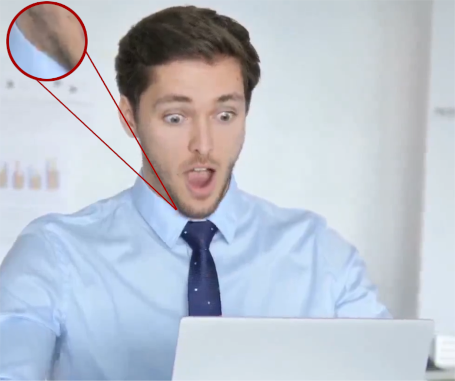 |  |
| ------------------------------------ | ------------------------------------ |
*Porównanie materiałów z efektem kompresji i oryginalnego kadru - otwarcie ust.*

W okolicy kołnierza nastąpiło niepożądane zjawisko zlewania koloru skóry z kolorem koszuli. W efekcie powstał defekt, w postaci koszuli przejmującej kolor skóry.  
  
| 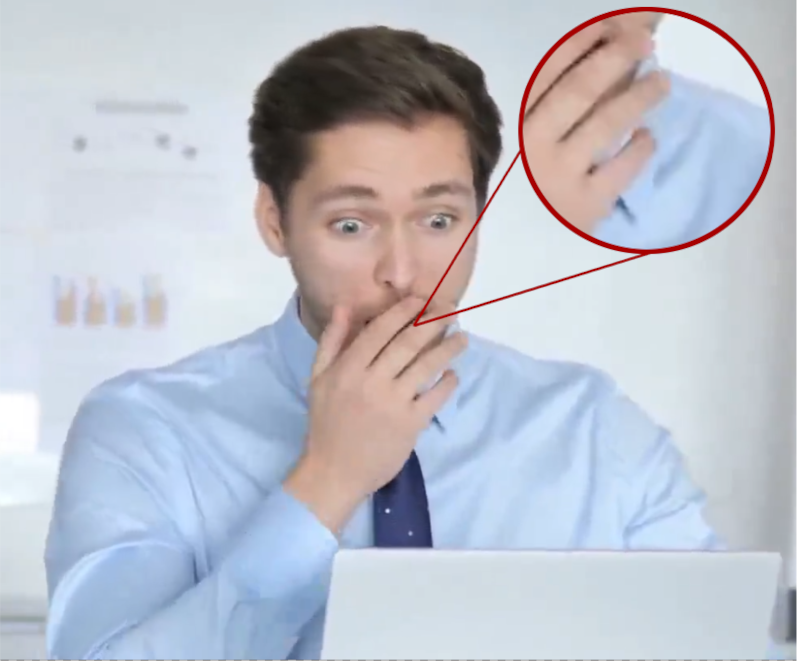 |  |
| ------------------------------------ | ------------------------------------ |
 *Porównanie materiałów z efektem kompresji i oryginalnego kadru - przysłonięcie twarzy.*

W obszarze między małym, a serdecznym palcem powstała plama o niebieskim kolorze, a koniec palca środkowego został rozmazany. Może to sugerować konsekwencje przesłonięcia twarzy i błędnego dostosowania maski do twarzy, lecz jest to efekt kompresji, a materiał jest prawdziwy.

| 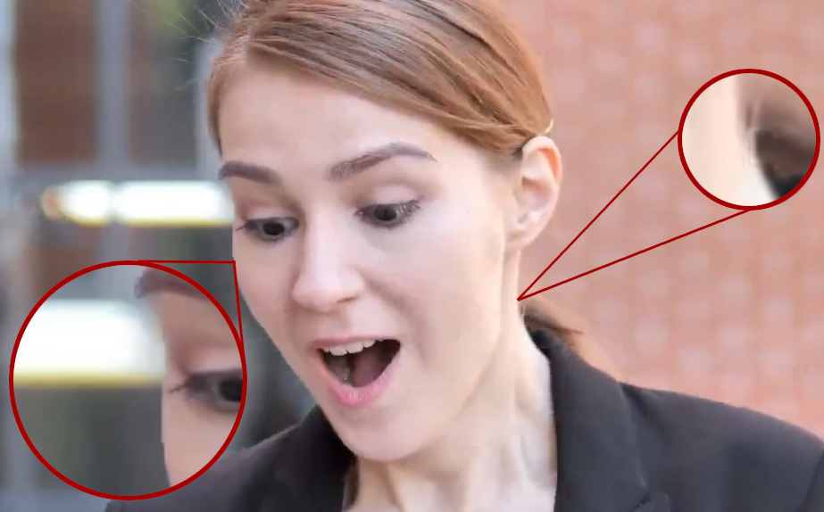 | 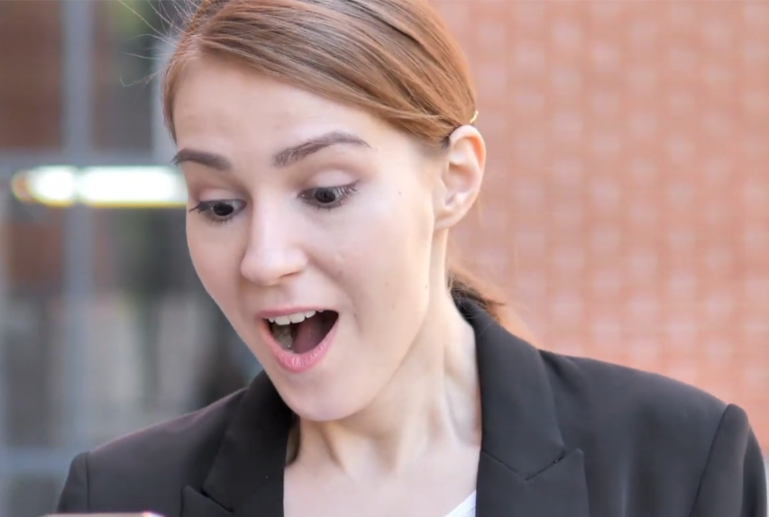 |
| ------------------------------------ | ------------------------------------ |
*Porównanie materiałów z efektem kompresji i oryginalnego kadru - otwarcie ust i rotacja głowy.*

Granica między twarzą, a tłem została wyraźnie zaznaczona, charakteryzując się ostrymi, prostymi liniami, która wygląda jak błąd. Dodatkowo okolice brwi wyglądają na rozmazane, a sama brew sprawia wrażenie “odklejającej się”. Ponadto, włosy na karku, wystające i wyglądające na sztucznie wygenerowane, nie wykazują spójności, co dodatkowo podkreśla wrażenie błędu w obróbce graficznej.

## Implikacje związane z syntetyzowaniem danych

W czasach syntetycznych danych, sztucznej inteligencji i wirtualnej rzeczywistości (VR) człowiek stoi na granicy dwóch światów - rzeczywistego i cyfrowego, oscylując między nimi. Bywają sytuacje, w których świat wirtualny może być postrzegany jako bardziej atrakcyjny niż rzeczywistość. Pomijając problemy zacierania się granicy pomiędzy tymi dwoma światami, a także zagrożenia wynikające z uzależnień od wirtualnej rzeczywistości, w kontekście niniejszego artykułu należy podnieść jeszcze jeden istotny problem, czyli intencjonalne wprowadzanie człowieka w błąd poprzez technologie cyfrowe. 

### Antropomorfizacja skryptów

Przy tak dynamicznym rozwoju sztucznej inteligencji pojawiają się problemy natury etycznej. Jednym z nich jest zagadnienie, kiedy można stwierdzić, że dany program komputerowy jest na tyle zaawansowany, aby przyznać mu obywatelstwo, umożliwić mu podejmowanie decyzji i traktować go jako indywidualną, niezależną jednostkę. W kontekście zaawansowanych dużych modeli językowych oraz projektów technologicznych, które potrafią imitować ludzkie zachowanie - widzieć, słyszeć i reagować, te problemy stają się coraz bardziej aktualne. W tym miejscu należy wspomnieć, że nie osiągnięto jeszcze poziomu rzeczywistej samoświadomości przez programy komputerowe i na razie wydaje się to być odległą perspektywą. Sztuczna inteligencja to zaawansowany algorytm, który na podstawie przedstawianych mu danych potrafi generalizować dane, które otrzyma i na tej podstawie stworzyć odpowiedź, która jest w stanie zaimponować człowiekowi przez niezwykle precyzyjne odtworzenie rzeczywistości.

Chatboty to jeden z najbardziej interaktywnych przykładów zastosowania sztucznej inteligencji. Każdy użytkownik może włączyć przeglądarkę, otworzyć chat i rozpocząć dyskusję z komputerem. Chatboty mają często nadawane cechy płciowe, a ich odpowiedzi bywają wielowątkowe i swoją formą przypominają konwersację z prawdziwym rozmówcą. Przyczynia się to do rozwoju relacji między programem komputerowym, a człowiekiem. Wówczas algorytm nie jest tylko narzędziem komputerowym, a kompanem, któremu powierza się swoje sekrety, zadaje pytania o opinie itp. Zjawisko to znane jest jako Efekt Elizy, którego początki sięgają 1996 roku, kiedy powstał program ELIZA, imitujący zachowanie psychoterapeuty. Przeprowadzone badania wykazały, że ludzie łatwo nawiązują emocjonalne więzi z takimi programami. 

Od 1996 roku technologia syntetyzowania głosu, obrazu i generowania tekstu znacznie ewoluowała, ułatwiając nawiązywanie interakcji i ludzi z maszynami. Współczesne reklamy widziane w internecie stale zachęcają do pobierania aplikacji "przyjaciela AI", które oferują nie tylko towarzystwo do konwersacji, ale także umożliwiają nawiązywanie głębszych, romantycznych więzi określanych mianem "Relacji 5.0". 

### Gwiazdy AI

Branże showbiznesu, pornograficzne czy influencerskie chętnie wykorzystują potencjał syntetyzowania danych. Na platformach społecznościowych, jak Instagram, można znaleźć profile poświęcone wirtualnym postaciom, które nie istnieją w rzeczywistości, są wygenerowanymi tworami, a przyciągają rzesze obserwujących. 

Jednym z najpopularniejszych kont jest @lilmiquela. Profil ten zgromadził ponad 2.5 miliona obserwujących, identyfikując się jako 19-letni robot mieszkający w Los Angeles i wspierający ruch #BlackLivesMatter. W komentarzach pod postami @lilmiquela można znaleźć komplementy, życzenia świąteczne, a nawet pytania o jej "robotyczną" naturę.

Poza Instagramem i jawnym sygnowaniem profili jako “robot”, albo “AI powered” nie brakuje również profili, które kreują się na prawdziwych ludzi na platformach takich jak OnlyFans. Nierzadko użytkownicy płacą takiemu “avatarowi” za zdjęcia - na przykład rozbierane nie podejrzewając nawet, że taka osoba nie istnieje, a zdjęcia są stworzone przez komputer. W kwietniu 2023 roku, na platformie Reddit pojawił się wpis użytkownika, który poczuł się oszukany, odkrywając, że przeznaczył swoje pieniądze na profil, za którym nie stoi rzeczywista osoba, lecz oszust z komputerowo wygenerowanymi materiałami kobiety.

W sferze rozrywki wykorzystuje się sztuczną inteligencję do tworzenia syntetycznych kopii influencerów, które interaktywnie angażują ich fanów. Algorytmy uczenia maszynowego, zaopatrzone w próbki głosu i obrazy celebryty, pozwalają na tworzenie wiernych kopii, które wypowiadają się i wyglądają jak oryginał. Fanów zachęca się do nabycia dostępu do takiego systemu, który pozwala im na prowadzenie wirtualnej komunikacji z "sztuczną kopią" ich idola.

## Podsumowanie

Rzeczywistość w dobie napędzanej AI stawia ludzkość w niespotykanym dotąd momencie, w którym każda jednostka może w przenośni stać się światowej klasy iluzjonistą, a takie iluzjonistyczne umiejętności, a będąc niepowołanych rękach rodzą globalne ryzyka. Zwłaszcza w połączeniu z aktualnym poziomem skomunikowania ludzkości. Jesteśmy momencie, w którym zagrożenia ze strony deepfake są nieznane szerszemu gronu potencjalnych ofiar, przez co jest ona nęcąca dla oszustów, mających świadomość wykładniczego rozwoju tej technologii w przyszłości. Należy przewidywać, iż momentem kulminacyjnym będzie tworzenie pełnometrażowych materiałów, których człowiek nie będzie wstanie rozróżnić od rzeczywistości, co może mieć katastrofalne skutki dla percepcji jednostki, grup społecznych czy narodów. Najbardziej zagrożone w tym obszarze są kraje wolnego świata, w których tego typu szum rozchodzi się najłatwiej, a technologia taka jak automatyczna klasyfikacja materiałów syntetycznych na ten moment nie spełnia oczekiwań co do zapewnienia bezpieczeństwa. Wprowadza nas to w posępną wizję konkursu zbrojeń obydwu stron, gdzie pierwsza ze stron konfliktu skupi się na wytwarzaniu iluzji, nowych technik i sposobów ich wykorzystania, a druga będzie się przed nimi bronić, identyfikując je i przeciwdziałać ich wpływowi. Aktualnie obserwujemy połowę pierwszego aktu teatru działań deepfake, przypominający niejako pantomimę. Należy mieć nadzieję, że w ostatniej scenie to świat realny pozostanie zwycięzcą.

Źródła:
https://www.humanprotocol.org/blog/what-is-the-eliza-effect-or-the-art-of-falling-in-love-with-an-ai

https://techxplore.com/news/2023-04-sex-companionship-ai-human-machine-relationships.html

https://eightify.app/summary/artificial-intelligence-and-technology/bella-influencer-clones-herself-with-ai-and-sells-out

https://mitsloan.mit.edu/ideas-made-to-matter/deepfakes-explained  

https://www.researchgate.net/publication/361086563_Deepfakes_generation_and_detection_state-of-the-art_open_challenges_countermeasures_and_way_forward

W 2017 roku na Redit zaczął wrzucać posty porno: https://www.britannica.com/technology/deepfake
2023 State of Deepfakes: https://www.pcmag.com/news/the-internet-is-full-of-deepfakes-and-most-of-them-are-porn
[https://www.irishexaminer.com/news/arid-41006312.html](https://www.irishexaminer.com/news/arid-41006312.html)
Andrew Lewis, Patrick Vu, Raymond M. Duch, Areeq Chowdhury, Deepfake detection with and without content warnings, https://doi.org/10.1098/rsos.231214, 27.11.2023
Carry Fisher / Star Wars / Księżniczka Leia https://expmag.com/2020/10/a-new-film-with-a-dead-star-thanks-to-cgi-and-deepfake-technology-its-possible/
in 2019’s _Star Wars: The Rise Of Skywalker,_
https://www.hollywoodreporter.com/movies/movie-news/how-furious-7-brought-late-845763/
[Paul Walker](https://www.hollywoodreporter.com/t/paul-walker/)
https://wustllawreview.org/2023/02/22/a-privacy-torts-solution-to-postmortem-deepfakes/
https://www.expresscomputer.in/guest-blogs/future-of-deepfake-in-education-and-employability-sector/106735/
Malaria must die, Backham: https://www.youtube.com/watch?v=QiiSAvKJIHo&ab_channel=ZeroMalariaBritain
 Cięcie kosztów animacji: https://www.bloomberg.com/news/articles/2023-11-09/ai-will-cut-cost-of-animated-films-by-90-jeff-katzenberg-says?embedded-checkout=true
Sora: https://openai.com/sora
V-Jepa: https://ai.meta.com/blog/v-jepa-yann-lecun-ai-model-video-joint-embedding-predictive-architecture/

Ikony pochodzą z https://www.flaticon.com/
